

  <h1>HydroDozerPump MQTT</h1>
  
<strong>ESP8266 two-pump hydroponic dosing controller for Home Assistant</strong>

  <table>
    <tr>
      <td align="center">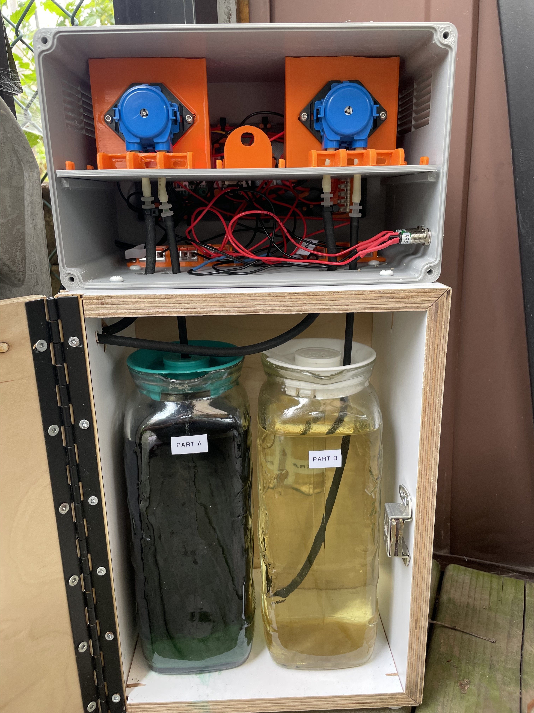 <em>Complete HydroDozerPump assembly</em></td>
      <td align="center">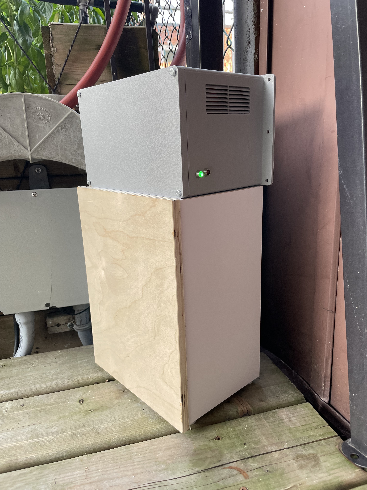 <em>Completed enclosure side view</em></td>
    </tr>
    <tr>
      <td align="center"> <em>Populated logic mounting plate</em></td>
      <td align="center"> <em>Pump mounting plate and brackets</em></td>
    </tr>
  </table>
  

    <a href="#build-with-platformio">Build</a> |
    <a href="#wiring">Wiring</a> |
    <a href="#enclosure-and-assembly">Enclosure</a> |
    <a href="#first-setup">First setup</a>
  

> Remaining image placeholder: the validated wiring drawing will be added after the reference image is available.

<h2 id="table-of-contents">Table of Contents</h2>

<ul>
  <li><a href="#overview">Overview</a></li>
  <li><a href="#typical-usage">Typical usage</a></li>
  <li><a href="#features">Features</a></li>
  <li><a href="#hardware">Hardware</a></li>
  <li><a href="#component-reference">Component reference</a></li>
  <li><a href="#device-naming">Device naming</a></li>
  <li><a href="#safety">Safety</a></li>
  <li><a href="#wiring">Wiring</a></li>
  <li><a href="#status-indicator-lights">Status indicator lights</a></li>
  <li><a href="#bill-of-materials">Bill of materials</a></li>
  <li><a href="#enclosure-and-assembly">Enclosure and assembly</a></li>
  <li><a href="#build-with-platformio">Build with PlatformIO</a></li>
  <li><a href="#upload-firmware">Upload firmware</a></li>
  <li><a href="#ota-upgrade">OTA upgrade and LittleFS data</a></li>
  <li><a href="#initial-wi-fi-configuration">Initial Wi-Fi configuration</a></li>
  <li><a href="#default-web-ui-login">Default Web UI login</a></li>
  <li><a href="#first-setup">First setup</a></li>
  <li><a href="#pump-calibration-and-dosing">Pump calibration and dosing</a></li>
  <li><a href="#web-ui-reference">Web UI reference</a></li>
  <li><a href="#home-assistant-interface">Home Assistant interface</a></li>
  <li><a href="#security">Security</a></li>
  <li><a href="#repository-layout">Repository layout</a></li>
  <li><a href="#license">License</a></li>
  <li><a href="#disclaimer">Disclaimer</a></li>
</ul>

<h2 id="overview">Overview</h2>

HydroDozerPump is a two-channel hydroponic dosing controller built around a Wemos D1 Mini (ESP8266). It drives Pump A and Pump B through an external driver, tracks the remaining volume in two nutrient bottles, and publishes its state and controls through MQTT discovery for Home Assistant.

<blockquote>
  
<strong>Beta / experimental hardware:</strong> this project is in beta and the current enclosure does not provide the wet/dry separation planned for a production design. It does not claim compliance with <a href="https://www.ul.com/services/environmental-rated-accessories-enclosures">ANSI/UL 50E</a>, <a href="https://www.nema.org/docs/default-source/standards-document-library/nema-250-2018-contents-and-scope.pdf?sfvrsn=96e44a99_1">NEMA 250</a>, <a href="https://webstore.iec.ch/en/publication/2448">IEC 60529</a>, or, where applicable, <a href="https://docinfofiles.nfpa.org/files/AboutTheCodes/70/70_A2022_NEC_P07_FD_PIReport_rev_1005.pdf">ANSI/NFPA 70 (NEC), Article 547</a>.

</blockquote>

The controller supports manual doses, per-pump calibration, three daily scheduler slots, bottle refill tracking, pump-run logging, browser-based configuration, and OTA firmware updates. It is intended for low-voltage dosing hardware only; select and wire the pump power supply and driver for the exact pumps in the installation.

<strong>Wi-Fi limitation:</strong> the ESP8266 supports 2.4 GHz 802.11 b/g/n Wi-Fi only. Use a compatible 2.4 GHz network for onboarding and normal operation.

<h2 id="typical-usage">Typical usage</h2>

<ol>
  <li>Connect the controller to Wi-Fi, configure MQTT, and confirm that the MQTT Settings page reports a connection and Home Assistant discovers the device.</li>
  <li>Route each pump outlet to a safe test container, verify the flow direction, then calibrate Pump A and Pump B using the measured volume.</li>
  <li>Measure each nutrient container's usable volume and enter the capacity for the matching bottle in Home Assistant.</li>
  <li>Set the total daily dose and the Pump A/Pump B ratio, then schedule the three dosing times for the required photoperiod.</li>
  <li>Confirm the first doses and bottle-volume tracking, then refill and reset bottle volumes as needed.</li>
</ol>

<h2 id="features">Features</h2>

<ul>
  <li>Two independently controlled dosing pumps with active-high driver outputs</li>
  <li>Two tracked nutrient bottles with capacity, remaining volume, and low-bottle alarm state</li>
  <li>Per-pump flow calibration and measured-volume dosing</li>
  <li>Three daily scheduler slots with a pause control and a delay between Pump A and Pump B</li>
  <li>WiFiManager onboarding, DHCP or static network settings, and mDNS</li>
  <li>MQTT state publishing and Home Assistant MQTT discovery</li>
  <li>Web UI for configuration, calibration, backups, pump logs, and safe MQTT commands</li>
  <li>LittleFS storage for configuration and pump-run logs</li>
  <li>OTA firmware updates and a hardware factory-reset input</li>
</ul>

<h2 id="hardware">Hardware</h2>

<ul>
  <li>Wemos D1 Mini or compatible ESP8266 board</li>
  <li>Two Kamoer peristaltic dosing pumps</li>
  <li>ULN2003 driver board</li>
  <li>LMNIL-775P-12V-G and LMNIL-775P-12V-R 12 V panel-mount indicator lights</li>
  <li>Power supply sized for the controller and the selected pumps</li>
  <li>Enclosure, wiring, and connectors appropriate for the installation</li>
</ul>

See <a href="docs/BOM.md">docs/BOM.md</a> for the current parts reference and items that still need model-specific confirmation.

<h2 id="component-reference">Component reference</h2>

The following generic reference photos show the controller, power, and wiring hardware used in this type of low-voltage enclosure build. Confirm the ratings and pin labels of the exact parts used in the installation.

<table>
  <tr>
    <td align="center"> <em>Wemos D1 Mini controller</em></td>
    <td align="center"> <em>Example DC buck converter</em></td>
    <td align="center"> <em>Lever wire connector</em></td>
  </tr>
  <tr>
    <td align="center"> <em>Connector kit and prewired leads</em></td>
    <td align="center"> <em>Crimping tool</em></td>
    <td align="center"> <em>Example buck-converter board layout</em></td>
  </tr>
  <tr>
    <td align="center"> <em>ULN2003 driver board</em></td>
    <td align="center" colspan="2"> <em>Kamoer peristaltic dosing pump</em></td>
  </tr>
  <tr>
    <td align="center" colspan="3"> <em>LMNIL-775P-12V-G / LMNIL-775P-12V-R 12 V status lights</em></td>
  </tr>
</table>

<h2 id="device-naming">Device naming</h2>

When no custom name is saved, the firmware derives a unique identity from the last two bytes of the ESP8266 Wi-Fi MAC address. The generated name uses the form <code>hydrodozerpump-XXXX</code>, where <code>XXXX</code> is a lowercase hexadecimal suffix. The MQTT client ID uses <code>HydroDozerPump-XXXX</code>.

A custom hostname can be saved from <strong>Settings &gt; Networking</strong>. It becomes the Wi-Fi hostname, mDNS hostname (<code>http://&lt;device-name&gt;.local</code>), and the node segment used in the HydroDozerPump MQTT topic tree. The firmware normalizes non-alphanumeric characters in the MQTT node segment to hyphens.

<h2 id="safety">Safety</h2>

<ul>
  <li>Never power a pump or status light from an ESP8266 GPIO pin. Use the ULN2003 driver and a supply sized for every connected load.</li>
  <li>Connect the ESP8266, ULN2003 board, and load power-supply grounds together so the control signals have a common reference.</li>
  <li>Verify pump polarity, driver input logic, tubing, and flow direction with pumps disconnected from nutrient bottles before normal dosing.</li>
  <li>Calibrate each pump with the actual tubing and liquid. Dose accuracy depends on the installed pump, tubing, fluid viscosity, and supply voltage.</li>
  <li>Keep a manual way to stop pump power during commissioning. The firmware hard maximum is not a replacement for safe hardware design and supervision.</li>
</ul>

<h2 id="wiring">Wiring</h2>

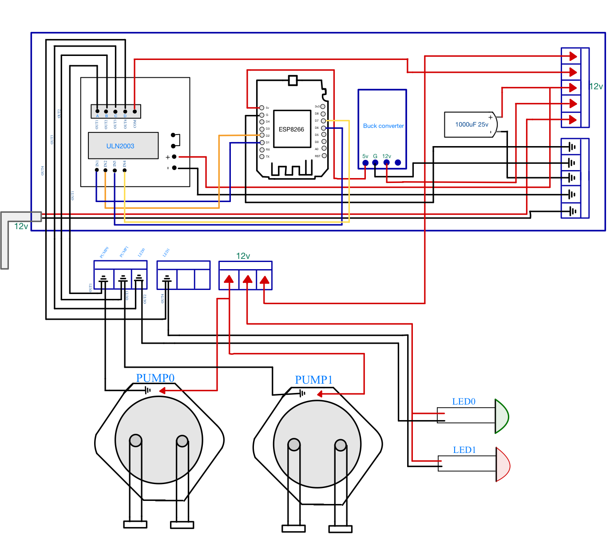 <em>HydroDozerPump technical wiring reference</em>

<table>
  <thead><tr><th>Controller pin</th><th>Connection</th></tr></thead>
  <tbody>
    <tr><td><code>D1</code> / <code>GPIO5</code></td><td>INT1 (<em>ULN2003</em>)</td></tr>
    <tr><td><code>D2</code> / <code>GPIO4</code></td><td>INT2 (<em>ULN2003</em>)</td></tr>
    <tr><td><code>D6</code> / <code>GPIO12</code></td><td>INT3 (<em>ULN2003</em>)</td></tr>
    <tr><td><code>D7</code> / <code>GPIO13</code></td><td>INT1 (<em>ULN2003</em>)</td></tr>
    <tr><td><code>D5</code> / <code>GPIO14</code></td><td>Factory-reset jumper input; short to <code>GND</code> during boot for at least three seconds</td></tr>
    <tr><td><code>GND</code></td><td>Common ground between the ESP8266, ULN2003 board, pumps, status lights, and power supply</td></tr>
  </tbody>
</table>

The firmware assumes active-high pump-driver inputs: <code>HIGH</code> turns a pump on and <code>LOW</code> turns it off. The two status-light outputs are also active-high and use PWM for dimming/pulsing. Change <code>PUMP_ACTIVE_HIGH</code> or <code>STATUS_LED_ACTIVE_HIGH</code> in <a href="src/HydroDozerPump/main.cpp">src/HydroDozerPump/main.cpp</a> only if the installed wiring uses inverted logic. See <a href="docs/hardware-pinout.md">docs/hardware-pinout.md</a> for electrical notes and the recovery-jumper procedure.

<h2 id="status-indicator-lights">Status indicator lights</h2>

The green light is connected through the ULN2003 from <code>D6</code>; the red light is connected from <code>D7</code>.

<table>
  <thead><tr><th>Green</th><th>Red</th><th>State and meaning</th></tr></thead>
  <tbody>
    <tr><td align="center">🟢 Solid</td><td align="center">⚫ Off</td><td><strong>Normal / idle:</strong> the controller is ready and no pump is currently running.</td></tr>
    <tr><td align="center">🟢 Pulsing</td><td align="center">⚫ Off</td><td><strong>Pumping:</strong> the green indicator pulses while Pump A or Pump B is running.</td></tr>
    <tr><td align="center">🟢 Solid or pulsing</td><td align="center">🔴 Solid</td><td><strong>Low bottle:</strong> red turns on when either bottle reaches the configured threshold. Green stays solid while idle and continues pulsing if a pump is running.</td></tr>
    <tr><td align="center">🟢 Alternating</td><td align="center">🔴 Alternating</td><td><strong>Dosing halted:</strong> green and red alternate every 350 ms when the scheduler is paused or a bottle is empty. Refill the bottle and resume the scheduler before dosing.</td></tr>
  </tbody>
</table>

<strong>Priority:</strong> the paused/empty alternating state overrides the normal, pumping, and low-bottle displays.

<h2 id="bill-of-materials">Bill of materials</h2>

See <a href="docs/BOM.md">docs/BOM.md</a> for the electronics, pump-control hardware, wiring, and enclosure parts list.

<h2 id="enclosure-and-assembly">Enclosure and assembly</h2>

<h3>First beta enclosure notice</h3>

<strong>This is the first beta release of the mounting and enclosure design.</strong> It is a work in progress. In this revision, the pumps, tubing, and nutrient bottles (the wet side) share the same overall enclosure assembly as the controller, ULN2003 driver, and wiring (the electronics side). It does not provide a tested liquid-tight physical barrier between those areas.

Do not describe this prototype as water-resistant, IP rated, NEMA rated, certified, or compliant with an electrical-enclosure standard. Do not use it unattended or where a leak, condensation, splash, or service activity could reach electronics. Disconnect power before filling bottles, changing tubing, or servicing a pump.

The next enclosure revision is intended to separate the wet side from the electronics using a physical bulkhead and independently managed cable/tube pass-throughs. The finished design will need to be evaluated and tested against the environment and installation requirements that apply to its actual use.

<h3>Standards and design references</h3>

<ul>
  <li><a href="https://www.ul.com/services/environmental-rated-accessories-enclosures">ANSI/UL 50E</a>: environmental considerations for electrical equipment enclosures, including maintaining an environmental seal.</li>
  <li><a href="https://www.nema.org/docs/default-source/standards-document-library/nema-250-2018-contents-and-scope.pdf?sfvrsn=96e44a99_1">NEMA 250</a>: enclosure types and environmental protection for electrical equipment up to 1000 V.</li>
  <li><a href="https://webstore.iec.ch/en/publication/2448">IEC 60529</a>: IP Code classification for protection provided by electrical enclosures against ingress.</li>
  <li><a href="https://docinfofiles.nfpa.org/files/AboutTheCodes/70/70_A2022_NEC_P07_FD_PIReport_rev_1005.pdf">ANSI/NFPA 70 (NEC), Article 547</a>: relevant where the installation is in an agricultural-building area subject to wet, damp, corrosive, or wash-down conditions.</li>
</ul>

These references do not create a blanket rule that every hydroponic enclosure must use one particular barrier. They establish enclosure-performance and installation expectations; a physical wet/dry separation is the safety approach planned for the next revision. Consult the authority having jurisdiction and a qualified electrical professional for any permanent or mains-connected installation.

The repository includes the current 3MF files:

<ul>
  <li><a href="Enclosure%20and%20mount/Enclosure_Box.3mf">Enclosure_Box.3mf</a></li>
  <li><a href="Enclosure%20and%20mount/Mounting_Llogic_plate.3mf">Mounting_Llogic_plate.3mf</a></li>
  <li><a href="Enclosure%20and%20mount/Mounting_Pump_Plate.3mf">Mounting_Pump_Plate.3mf</a></li>
</ul>

Confirm printed clearances, hardware sizes, pump dimensions, and electrical isolation against the exact components before printing or assembling the enclosure.

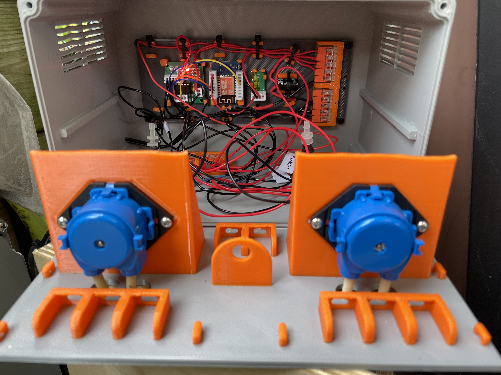 <em>Enclosure assembly reference</em>

<h2 id="build-with-platformio">Build with PlatformIO</h2>

<h3>Requirements</h3>

<ul>
  <li>VS Code with the PlatformIO extension, or PlatformIO CLI</li>
  <li>A Wemos D1 Mini connected by USB</li>
  <li>The dependencies listed in <a href="platformio.ini">platformio.ini</a></li>
</ul>

<pre><code>pio run</code></pre>

The build target is <code>WEMOS_D1_Mini</code>. The pre-build script updates <code>include/fw_version_auto.h</code>.

<h2 id="upload-firmware">Upload firmware</h2>

Replace <code>&lt;PORT&gt;</code> with the serial port assigned to the board:

<pre><code>pio run -t upload --upload-port &lt;PORT&gt;
pio run -t uploadfs --upload-port &lt;PORT&gt;</code></pre>

The first command uploads the firmware. The second uploads the LittleFS web interface and filesystem data stored in <code>data/web/</code>.

<h2 id="ota-upgrade">OTA upgrade and LittleFS data</h2>

<strong>Important:</strong> firmware and LittleFS are separate flash areas. A firmware-only OTA update normally preserves the saved configuration and pump log. Uploading a LittleFS image replaces the filesystem, including <code>/config.json</code> and <code>/pump_runs.csv</code>.

<ol>
  <li>Before any LittleFS upload, download <code>config.json</code> and <code>pump_runs.csv</code> from <strong>Settings &gt; Backup &amp; Restore</strong>.</li>
  <li>For a firmware-only OTA update, sign in to the Web UI and open <code>/update</code>. Upload only the firmware <code>.bin</code>, then verify that MQTT reconnects.</li>
  <li>After a LittleFS upload, restore the backed-up <code>config.json</code> and reboot the controller. Restore <code>pump_runs.csv</code> separately if its history is needed.</li>
  <li>If no backup is restored, configure the controller again, including Wi-Fi, network name, MQTT settings, time zone, credentials, bottle capacities, pump flow values, and scheduler settings.</li>
</ol>

<h2 id="initial-wi-fi-configuration">Initial Wi-Fi configuration</h2>

This project uses <a href="https://github.com/tzapu/WiFiManager">WiFiManager</a> so Wi-Fi credentials are not hard-coded in the firmware.

<ol>
  <li>Power the device with no saved Wi-Fi credentials, or clear them using a factory reset.</li>
  <li>Connect a phone or computer to the temporary access point named <code>HydroDozerPump-Setup</code>.</li>
  <li>Complete the WiFiManager captive portal and save the local 2.4 GHz network credentials.</li>
  <li>After the controller joins the network, open its assigned IP address or mDNS hostname, such as <code>http://hydrodozerpump-ab12.local</code>.</li>
</ol>

<h2 id="default-web-ui-login">Default Web UI login</h2>

The initial Web UI and OTA credentials are case-sensitive:

<table>
  <tr><th>Username</th><td><code>admin</code></td></tr>
  <tr><th>Password</th><td><code>adminpass</code></td></tr>
</table>

Open <code>http://&lt;device-ip&gt;/login</code> when Web UI login is required. Change these values immediately at <strong>Settings &gt; OTA Settings</strong>; the same credentials control both the Web UI login and the <code>/update</code> OTA page. See <a href="docs/security.md">docs/security.md</a>.

<h2 id="first-setup">First setup</h2>

<ol>
  <li><strong>Upload the firmware and Web UI:</strong> upload the firmware, then upload the LittleFS image so the files in <code>data/web/</code> are available on the controller.</li>
  <li><strong>Connect to Wi-Fi:</strong> follow <a href="#initial-wi-fi-configuration">Initial Wi-Fi configuration</a> when no Wi-Fi credentials are saved.</li>
  <li><strong>Set network and time:</strong> in <strong>Settings &gt; Networking</strong>, set the hostname and choose DHCP or static addressing. In <strong>Settings &gt; Time Synchronization</strong>, apply the correct POSIX time-zone string. Accurate time is required for the daily scheduler.</li>
  <li><strong>Secure the device:</strong> replace the Web UI/OTA credentials in <strong>Settings &gt; OTA Settings</strong> and replace the public MQTT defaults in <strong>Settings &gt; MQTT Settings</strong>.</li>
  <li><strong>Connect MQTT:</strong> configure the broker, port, client ID, and a dedicated MQTT account. Confirm that the MQTT page reports a connected state.</li>
  <li><strong>Configure the dosing system:</strong> set bottle capacities, calibrate each pump, set the low-bottle alarm, and configure the schedule before enabling normal dosing.</li>
  <li><strong>Verify Home Assistant:</strong> confirm the MQTT-discovered HydroDozerPump device and controls appear in Home Assistant. The topic contract is documented in <a href="docs/mqtt-contract-v1.md">docs/mqtt-contract-v1.md</a>.</li>
</ol>

<h2 id="pump-calibration-and-dosing">Pump calibration and dosing</h2>

The controller starts with a nominal pump flow of <code>0.9 mL/s</code>; this is only a starting point. Use <strong>Pump Calibration</strong> to run a fixed-duration test, measure the volume dispensed, and save the result for each pump. Recalibrate after changing a pump, tube, liquid, or supply voltage.

The scheduler divides the configured total daily volume across three time slots. Pump A runs first; when both pumps are needed, Pump B runs after the configured safety gap. The scheduler requires valid synchronized time and can be paused from Home Assistant. Bottle volume is reduced after allowed doses and can be reset to the configured capacity using the refill actions.

<h2 id="web-ui-reference">Web UI reference</h2>

> The screenshots below use generic, public-safe example values. Do not publish a device backup or screenshot containing private credentials, hostnames, or network addresses.

The home page provides access to Pump Calibration, Setup, MQTT command sending, Pump Log, Firmware Upgrade, and reboot. The complete route map is maintained in <a href="docs/web-pages-index.md">docs/web-pages-index.md</a>.

<table>
  <tr>
    <td align="center">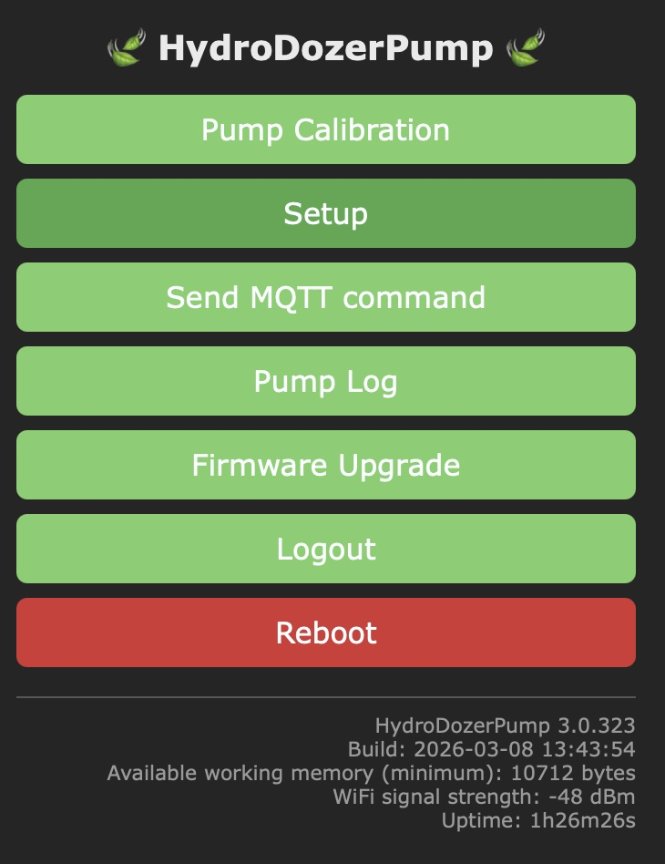 <em>HydroDozerPump Web UI start page</em></td>
  </tr>
</table>

<h3>Pump calibration</h3>

Select <strong>Calibration Pump A</strong> or <strong>Calibration Pump B</strong> to run that pump for 60 seconds. After it stops, measure the dispensed liquid, enter the measured volume in mL, and select <strong>Apply</strong>. This stores the measured flow rate for future manual and scheduled doses.

<table>
  <tr>
    <td align="center">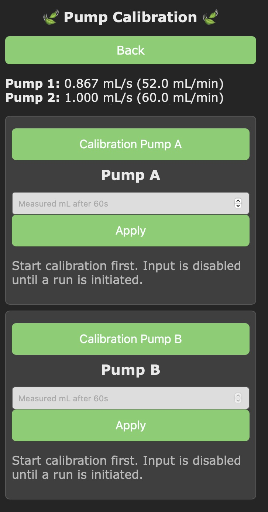 <em>Pump calibration for Pump A and Pump B</em></td>
  </tr>
</table>

<h3>Backup and restore</h3>

<strong>Download config.json</strong> saves the device configuration, while <strong>Download pump_runs.csv</strong> saves the dosing log. Restore each file only to the matching restore control. A restored <code>config.json</code> can contain credentials, so keep backups private; reboot after restoring configuration. A restored pump log must preserve its CSV header.

<table>
  <tr>
    <td align="center">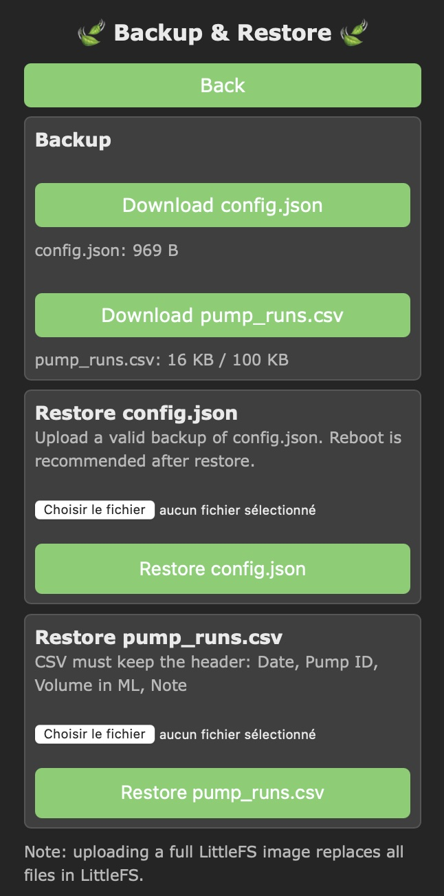 <em>Configuration and pump-log backup and restore</em></td>
  </tr>
</table>

<h3>Pump log</h3>

The pump-log page summarizes the three scheduler slots and shows the newest pump-run entries first. Use <strong>Download Pump Log</strong> to save the CSV file, and <strong>Refresh</strong> to reload the current entries. The log uses the columns <code>Date</code>, <code>Pump ID</code>, <code>Volume in ML</code>, and <code>Note</code>.

<table>
  <tr>
    <td align="center">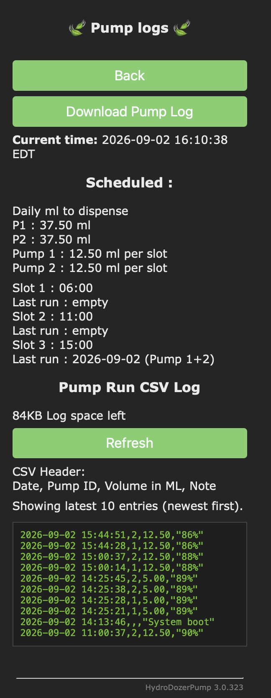 <em>Pump schedule summary and CSV pump-run log</em></td>
  </tr>
</table>

<h3>Firmware upgrade</h3>

Select <strong>Firmware</strong> in the ElegantOTA page to upload the compiled firmware <code>.bin</code>. Select <strong>Filesystem</strong> only when uploading the LittleFS image; it replaces the Web UI and stored files, so back up <code>config.json</code> and <code>pump_runs.csv</code> first.

<table>
  <tr>
    <td align="center">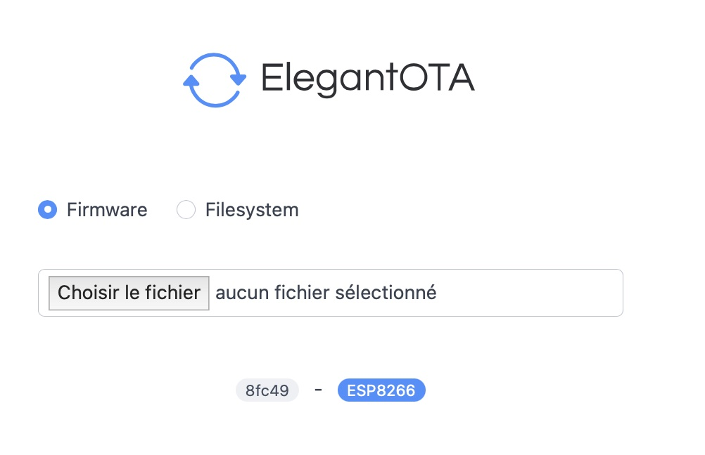 <em>Firmware and LittleFS upload page</em></td>
  </tr>
</table>

<h3>Send MQTT command</h3>

The sender accepts only the templates shown below and validates the JSON before processing it. Scheduler and capacity templates publish to <code>hydrodozerpump/&lt;node&gt;/ha/cmd</code>; refill templates publish to <code>hydrodozerpump/&lt;node&gt;/cmd</code>. Commands are non-retained. If MQTT is disconnected, a valid command is applied locally and is not published.

<table>
  <tr>
    <td align="center">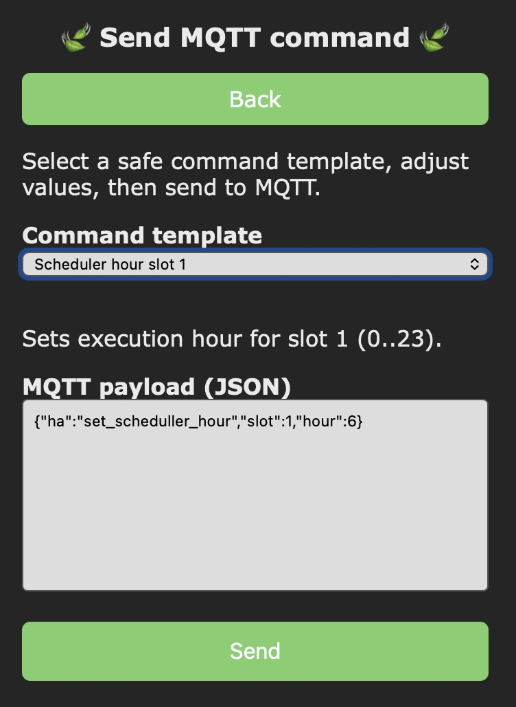 <em>Safe MQTT command sender</em></td>
  </tr>
</table>

<table>
  <thead>
    <tr><th>Template</th><th>Accepted value</th><th>Effect</th></tr>
  </thead>
  <tbody>
    <tr><td>Daily total mL</td><td>Positive mL, up to the current safe maximum</td><td>Sets the total liquid scheduled for the day, divided across the three daily slots.</td></tr>
    <tr><td>Part A ratio</td><td>0-100%</td><td>Sets Pump A's share of the daily total and automatically adjusts Part B to make 100%.</td></tr>
    <tr><td>Part B ratio</td><td>0-100%</td><td>Sets Pump B's share of the daily total and automatically adjusts Part A to make 100%.</td></tr>
    <tr><td>Scheduler pause</td><td><code>1</code> pause; <code>0</code> resume</td><td>Stops or resumes scheduled dosing. It does not change the saved schedule.</td></tr>
    <tr><td>Low Bottle Alarm</td><td>0-100%</td><td>Sets the percentage at or below which the low-bottle alarm and red indicator are activated.</td></tr>
    <tr><td>Scheduler hour slot 1</td><td>Hour 0-23</td><td>Sets the execution hour for the first daily dose slot.</td></tr>
    <tr><td>Scheduler hour slot 2</td><td>Hour 0-23</td><td>Sets the execution hour for the second daily dose slot.</td></tr>
    <tr><td>Scheduler hour slot 3</td><td>Hour 0-23</td><td>Sets the execution hour for the third daily dose slot.</td></tr>
    <tr><td>Bottle 1 capacity</td><td>More than 0 and up to 10,000 mL</td><td>Sets Bottle A's capacity. Remaining volume is capped at the new capacity when necessary.</td></tr>
    <tr><td>Bottle 2 capacity</td><td>More than 0 and up to 10,000 mL</td><td>Sets Bottle B's capacity. Remaining volume is capped at the new capacity when necessary.</td></tr>
    <tr><td>Refill Bottle A</td><td>No value</td><td>Sets Bottle A's remaining volume to its configured capacity.</td></tr>
    <tr><td>Refill Bottle B</td><td>No value</td><td>Sets Bottle B's remaining volume to its configured capacity.</td></tr>
  </tbody>
</table>

<h3>MQTT discovery and Home Assistant</h3>

With MQTT discovery enabled, Home Assistant automatically exposes HydroDozerPump controls, bottle information, configuration, and diagnostics. The detailed views below use public-safe example network values.

<table>
  <tr>
    <td align="center">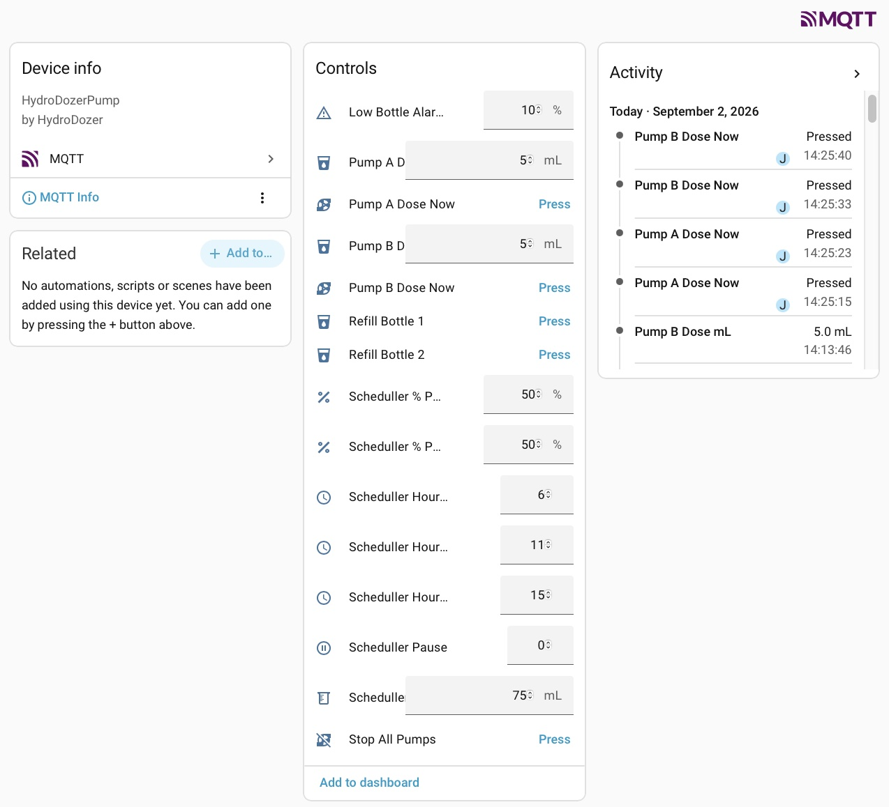 <em>Home Assistant MQTT discovery: controls</em></td>
    <td align="center">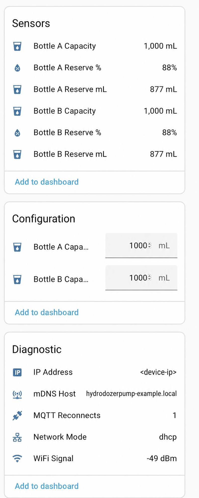 <em>Home Assistant MQTT discovery: configuration and diagnostics</em></td>
  </tr>
  <tr>
    <td align="center" colspan="2">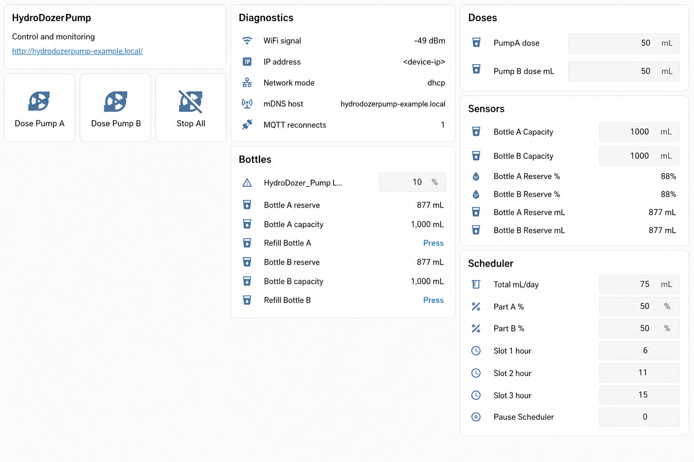 <em>Example HydroDozerPump Home Assistant dashboard</em></td>
  </tr>
</table>

<h3>Network, MQTT, and recovery settings</h3>

<table>
  <tr>
    <td align="center">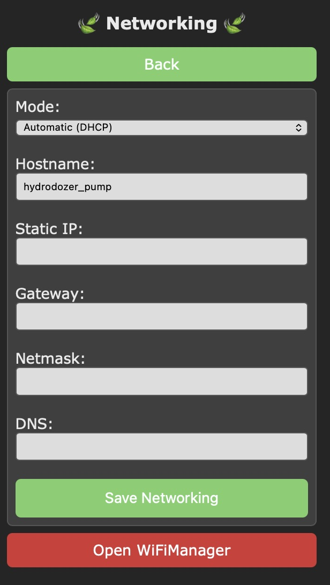 <em>Network settings: DHCP, hostname, and optional static address</em></td>
    <td align="center">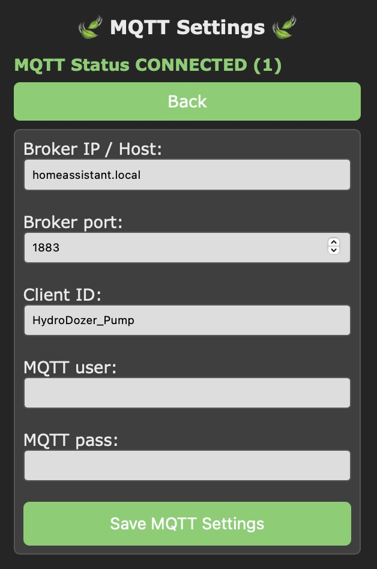 <em>MQTT broker and client settings</em></td>
  </tr>
  <tr>
    <td align="center">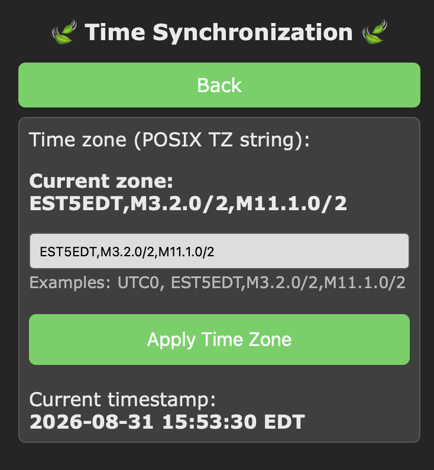 <em>Time Synchronization: <code>/settings/time</code></em></td>
    <td align="center">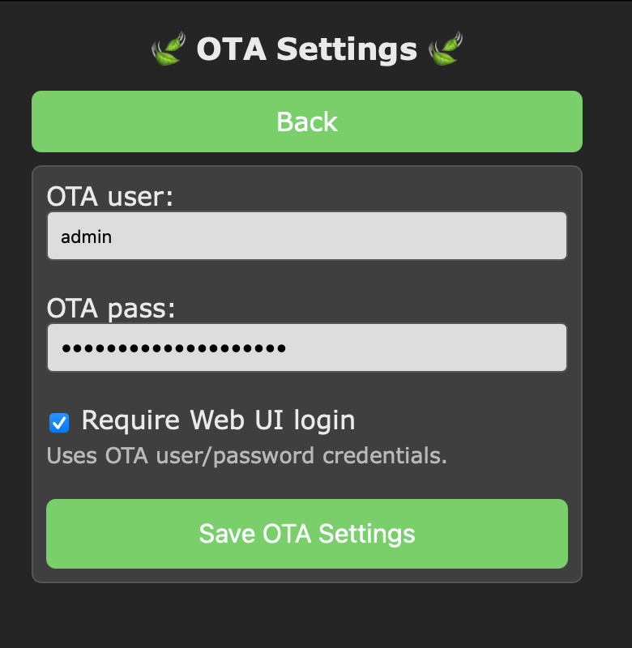 <em>OTA Settings: <code>/settings/ota</code></em></td>
  </tr>
  <tr>
    <td align="center" colspan="2"> <em>Reset controls at the bottom of <code>/settings</code></em></td>
  </tr>
</table>

<strong>Factory reset:</strong> the Web UI factory-reset action and the D5 hardware jumper erase Wi-Fi credentials and format LittleFS. This removes the saved configuration, pump log, and Web UI files. Re-upload the LittleFS image before using the Web UI again after a factory reset.

<h2 id="home-assistant-interface">Home Assistant interface</h2>

When MQTT is connected, HydroDozerPump publishes Home Assistant MQTT discovery messages for dosing controls, bottle capacity and reserve values, scheduler controls, alarms, network diagnostics, and pump controls. Home Assistant can issue safe dosing and configuration commands through the discovered entities. Use the documented topic contract when integrating with automations outside Home Assistant.

<h3 id="home-assistant-dashboard">Dashboard template</h3>

The <a href="HA/hydrodozerpump-dashboard.yaml">hydrodozerpump-dashboard.yaml</a> template provides pump controls, scheduler settings, doses, bottle information, and diagnostics for one device.

<ol>
  <li>Confirm MQTT discovery has created the HydroDozerPump device and its entities.</li>
  <li>Copy <code>HA/hydrodozerpump-dashboard.yaml</code> to the Home Assistant configuration directory, then register it as a YAML dashboard in <code>configuration.yaml</code>:</li>
</ol>

<pre><code>lovelace:
  dashboards:
    hydrodozerpump-dashboard:
      mode: yaml
      filename: hydrodozerpump-dashboard.yaml
      title: HydroDozerPump
      icon: mdi:pump
      show_in_sidebar: true</code></pre>

<ol start="3">
  <li>Restart Home Assistant, open the new dashboard, and confirm that every card resolves to an entity.</li>
</ol>

<strong>Remap the template before use:</strong> it intentionally uses the placeholder <code>hydrodozerpump_example</code>. In <strong>Settings &gt; Devices &amp; services &gt; Entities</strong>, copy the real IDs created by discovery. A device named <code>hydrodozerpump-ab12</code> may use <code>hydrodozerpump_ab12</code>, but do not assume this: Home Assistant can add a suffix when an ID already exists.

<ul>
  <li>Replace every <code>hydrodozerpump_example</code> occurrence with the confirmed prefix, including both <code>entity:</code> and button <code>target.entity_id</code> values.</li>
  <li>Correct any remaining individual entity IDs from the Entities page; the template's names are examples and may not match your discovered names.</li>
  <li>Replace <code>http://hydrodozerpump-example.local</code> with the controller's actual hostname if you want the dashboard link to work.</li>
  <li>You may freely change card <code>name:</code> values; they are labels only and do not change the entity mapping.</li>
</ul>

See the <a href="https://www.home-assistant.io/dashboards/dashboards/">Home Assistant YAML dashboard documentation</a> for alternative dashboard registration options.

<h2 id="security">Security</h2>

The firmware includes public initial credentials for setup. Change the Web UI/OTA and MQTT defaults before connecting the device to a trusted network or broker. Do not commit a device configuration backup, Wi-Fi password, MQTT password, or OTA password to this repository. See <a href="docs/security.md">docs/security.md</a> for the required changes.

<h2 id="repository-layout">Repository layout</h2>

<pre><code>src/HydroDozerPump/    Firmware source
data/web/              Web interface files stored in LittleFS
docs/                  Hardware, commissioning, MQTT, security, and Web UI documentation
Enclosure and mount/   3D-printable 3MF files
include/               Generated firmware version header
platformio.ini         PlatformIO project configuration</code></pre>

<h2 id="license">License</h2>

This project is licensed under the <a href="LICENSE">MIT License</a>.

<h2 id="disclaimer">Disclaimer</h2>

This project controls pumps and chemical or nutrient dosing. Review, test, and validate the electrical design, calibration, dose limits, and fail-safe behavior before use.

This project was created with the assistance of AI. Review all hardware, firmware, documentation, and safety decisions independently before use.

