# HydroDozerPump Hardware BOM

  This bill of materials lists the electronics, pumps, connectors, assembly hardware, and printable parts used by the HydroDozerPump project. Quantities are for one two-pump controller unless noted otherwise. Confirm electrical ratings, connector types, screw sizes, and printed-part fit against the exact components used in the build.

<h2 id="component-grid">Components</h2>

<table>
  <tr>
    <td valign="top" width="33%">
      <h3>Wemos D1 Mini</h3>
      
<strong>Quantity:</strong> 1

      
ESP8266 controller running the dosing firmware, Web UI, Wi-Fi, MQTT, and Home Assistant discovery.

      
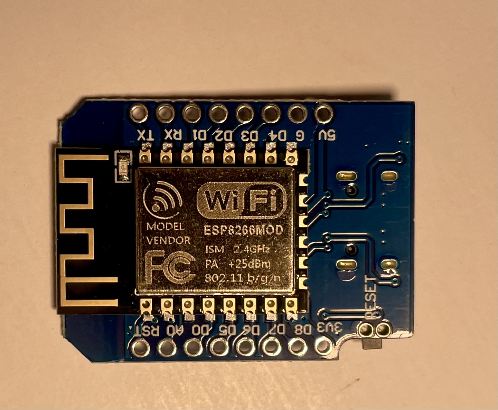

    </td>
    <td valign="top" width="33%">
      <h3>ULN2003 driver board</h3>
      
<strong>Quantity:</strong> 1

      
Switches the two pump loads and green/red status lights from the ESP8266 control outputs.

      
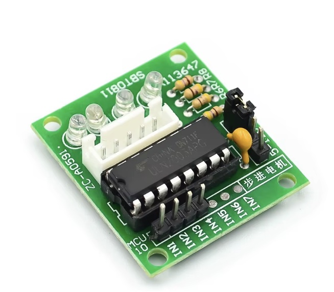

    </td>
    <td valign="top" width="33%">
      <h3>Kamoer dosing pump</h3>
      
<strong>Quantity:</strong> 2

      
Peristaltic pumps that dispense nutrient Part A and Part B. Calibrate each installed pump separately.

      
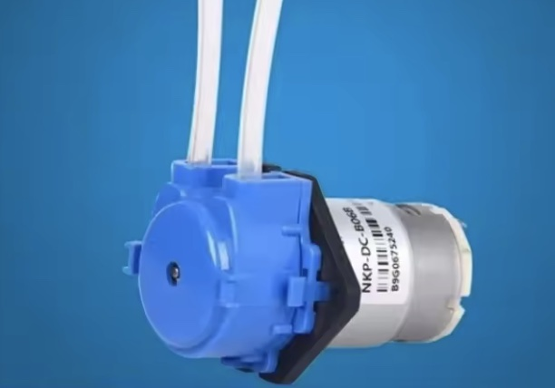

    </td>
  </tr>
  <tr>
    <td valign="top">
      <h3>12 V indicator lights</h3>
      
<strong>Quantity:</strong> 1 green and 1 red

      
LMNIL-775P-12V-G and LMNIL-775P-12V-R panel-mount lights for controller status indication.

      
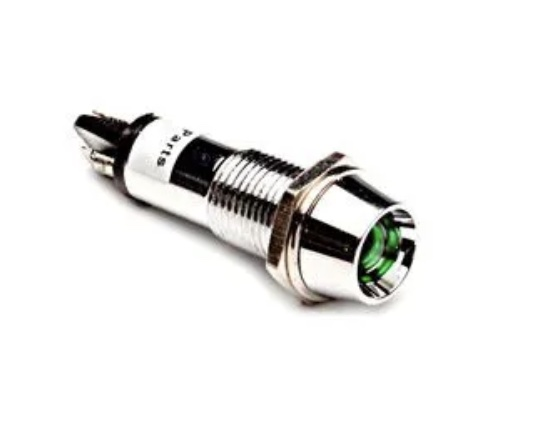

    </td>
    <td valign="top">
      <h3>Buck converter</h3>
      
<strong>Quantity:</strong> 1

      
Adjustable DC converter used to provide regulated 5 V for the Wemos. Verify the input range and output setting before connection.

      

    </td>
    <td valign="top">
      <h3>Lever wire connectors</h3>
      
<strong>Quantity:</strong> As required

      
Serviceable power-distribution and load wiring connectors. Select connectors rated for the installed pump current.

      
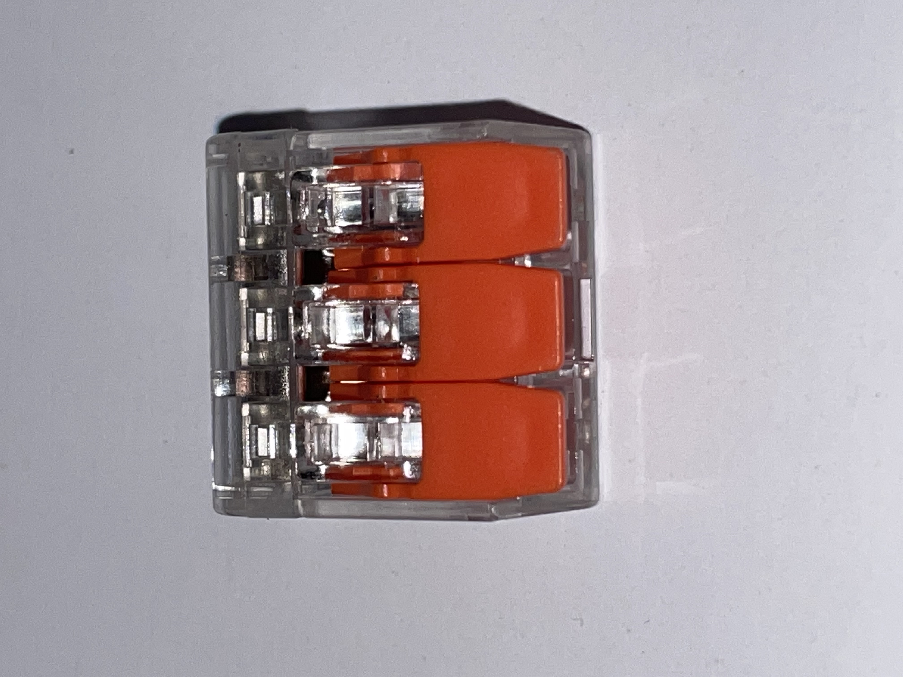

    </td>
  </tr>
  <tr>
    <td valign="top">
      <h3>JST-XH connector kit</h3>
      
<strong>Quantity:</strong> 1 kit

      
Housings and contacts for controller, pump, and service harnesses. Confirm the chosen pitch and pin count before ordering.

      
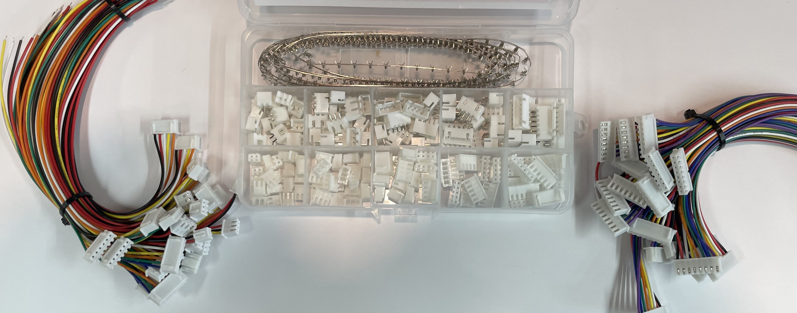

    </td>
    <td valign="top">
      <h3>Prewired connector cables</h3>
      
<strong>Quantity:</strong> As required

      
Prewired and crimped leads for serviceable low-voltage control connections.

      

    </td>
    <td valign="top">
      <h3>Crimping tool</h3>
      
<strong>Quantity:</strong> 1

      
Crimping tool suitable for the selected connector terminals.

      
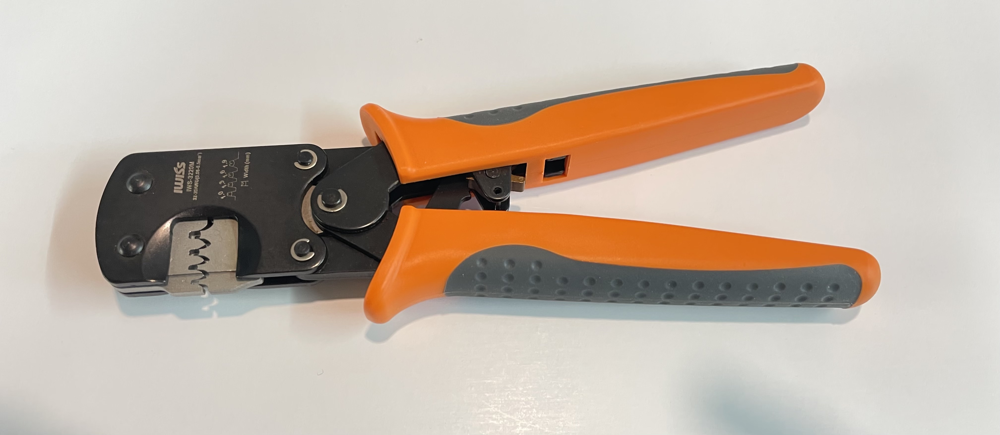

    </td>
  </tr>
  <tr>
    <td valign="top">
      <h3>1000 uF, 25 V electrolytic capacitor</h3>
      
<strong>Quantity:</strong> 1

      
Polarized bulk decoupling capacitor for the low-voltage supply rail. Observe polarity and do not exceed the 25 V rating.

      
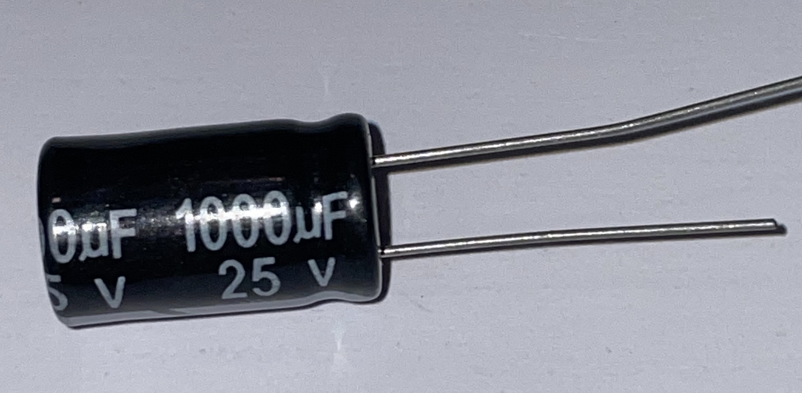

    </td>
    <td valign="top">
      <h3>12 V pump power supply</h3>
      
<strong>Quantity:</strong> 1

      
<strong>Model:</strong> <em>TBD</em>

      
Supply for the pumps, indicator lights, and buck-converter input. Size the current capacity for both pumps and all connected loads.

      
<em>Reference image placeholder.</em>

    </td>
    <td valign="top">
      <h3>Factory-reset jumper or switch</h3>
      
<strong>Quantity:</strong> 1

      
Connects D5 to GND during boot for recovery. Hold for at least three seconds to trigger the factory reset.

      
<em>Reference image placeholder.</em>

    </td>
  </tr>
  <tr>
    <td valign="top" colspan="3">
      <h3>Printable enclosure parts</h3>
      
<strong>Quantity:</strong> 1 set

      
Print the enclosure box, populated logic mounting plate, and pump mounting plate. Confirm the fit against the selected components before final assembly.

      
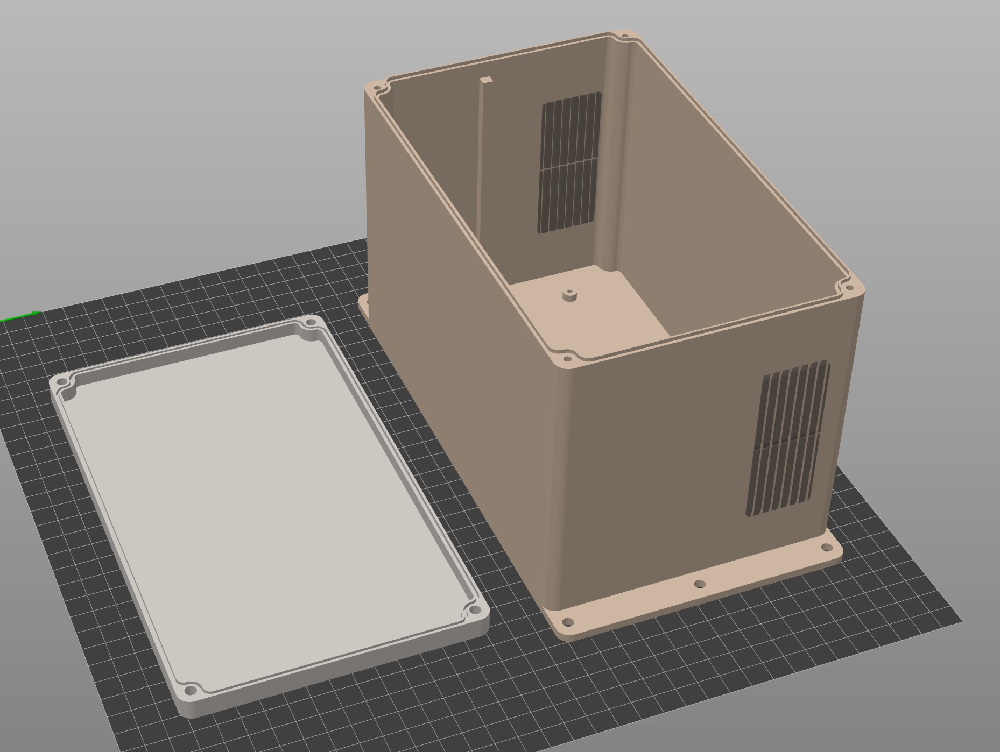 <em>Enclosure box and lid</em>

      
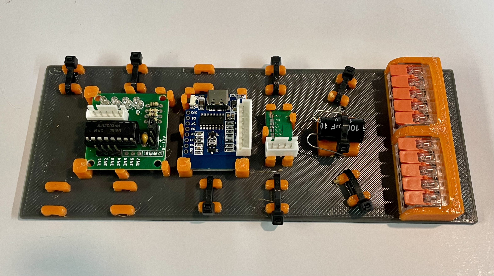 <em>Logic mounting plate</em>

      
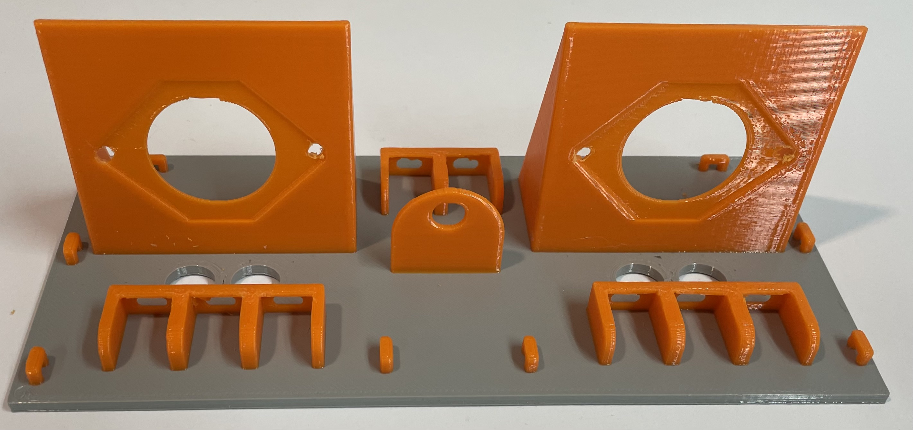 <em>Pump mounting plate</em>

      
<a href="../Enclosure%20and%20mount/Enclosure_Box.3mf">Enclosure_Box.3mf</a> <a href="../Enclosure%20and%20mount/Mounting_Logic_plate.3mf">Mounting_Logic_plate.3mf</a> <a href="../Enclosure%20and%20mount/Mounting_Pump_Plate.3mf">Mounting_Pump_Plate.3mf</a>

    </td>
  </tr>
</table>

<h2 id="assembly-hardware">Assembly hardware</h2>

<table>
  <thead>
    <tr>
      <th>Hardware</th>
      <th>Quantity</th>
      <th>Use</th>
    </tr>
  </thead>
  <tbody>
    <tr>
      <td>Fasteners and standoffs</td>
      <td><em>TBD</em></td>
      <td>Secure the controller, driver board, pumps, mounting plates, and enclosure panels. Confirm dimensions against the printed parts before ordering.</td>
    </tr>
    <tr>
      <td>Cable ties</td>
      <td>As required</td>
      <td>Harness management and strain relief inside the enclosure.</td>
    </tr>
    <tr>
      <td>Tubing and bottle fittings</td>
      <td><em>TBD</em></td>
      <td>Connect the Kamoer pumps to the nutrient bottles and dosing lines. Match tubing to the installed pump heads and liquids.</td>
    </tr>
    <tr>
      <td>Low-voltage hookup wire</td>
      <td>As required</td>
      <td>Controller, driver, status-light, pump, and power wiring.</td>
    </tr>
  </tbody>
</table>

<h2 id="component-images">Component images</h2>

  The component cards above contain the available reference images. The image files remain in this folder so they can be reused by the assembly and wiring documentation.

<h2 id="printable-parts-and-credits">Printable parts and credits</h2>

<table>
  <thead>
    <tr>
      <th>Part or holder</th>
      <th>Source</th>
    </tr>
  </thead>
  <tbody>
    <tr>
      <td>Wemos D1 Mini board holder</td>
      <td><a href="https://www.printables.com/model/48425-wemos-d1-mini-frame-module-for-enclosures-openscad">Printables model 48425</a></td>
    </tr>
    <tr>
      <td>Capacitor holder</td>
      <td><a href="https://www.thingiverse.com/thing:4089178">Thingiverse model 4089178</a></td>
    </tr>
    <tr>
      <td>Generic lever wire connector holder</td>
      <td><a href="https://www.printables.com/model/170622-generic-lever-wire-connector-holder">Printables model 170622</a></td>
    </tr>
    <tr>
      <td>Cable tie holder</td>
      <td><a href="https://github.com/pfliegster/cable-tie-holders">pfliegster/cable-tie-holders</a></td>
    </tr>
    <tr>
      <td>Standoff</td>
      <td><a href="https://www.thingiverse.com/thing:351092">Thingiverse model 351092</a></td>
    </tr>
    <tr>
      <td>Enclosure box</td>
      <td><a href="https://www.printables.com/model/72839-customizable-parametric-stable-and-waterproof-elec">Printables enclosure model 72839</a></td>
    </tr>
  </tbody>
</table>

<h2 id="power-and-wiring-note">Power and wiring note</h2>

  The power path is <strong>12 V supply &rarr; pumps, status lights, and buck-converter input &rarr; regulated 5 V to the Wemos</strong>. The ESP8266 GPIO pins control the ULN2003 only; they must not power pumps or indicator lights directly. Connect the Wemos, ULN2003, and load power-supply returns to a common ground. See the <a href="hardware-pinout.md">hardware pinout</a> and the <a href="../README.md#wiring">Wiring</a> section for the connection details.

